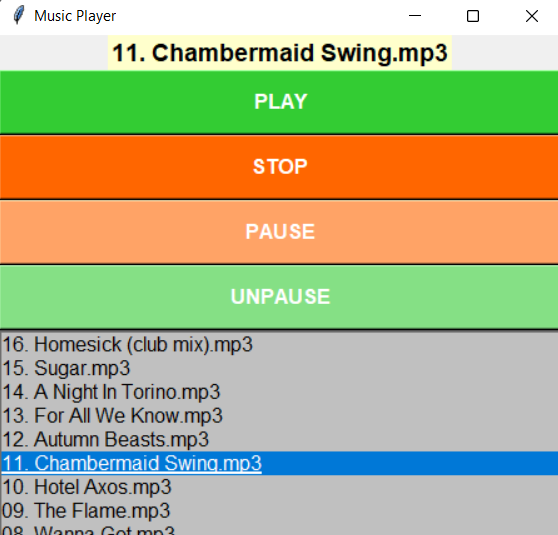

# MP3 PLAYER
A basic GUI application to play stock mp3s using the tkinter and pygame packages. The music folder is selected and then individual songs can be played, paused or stopped.

## Printscreen of application
